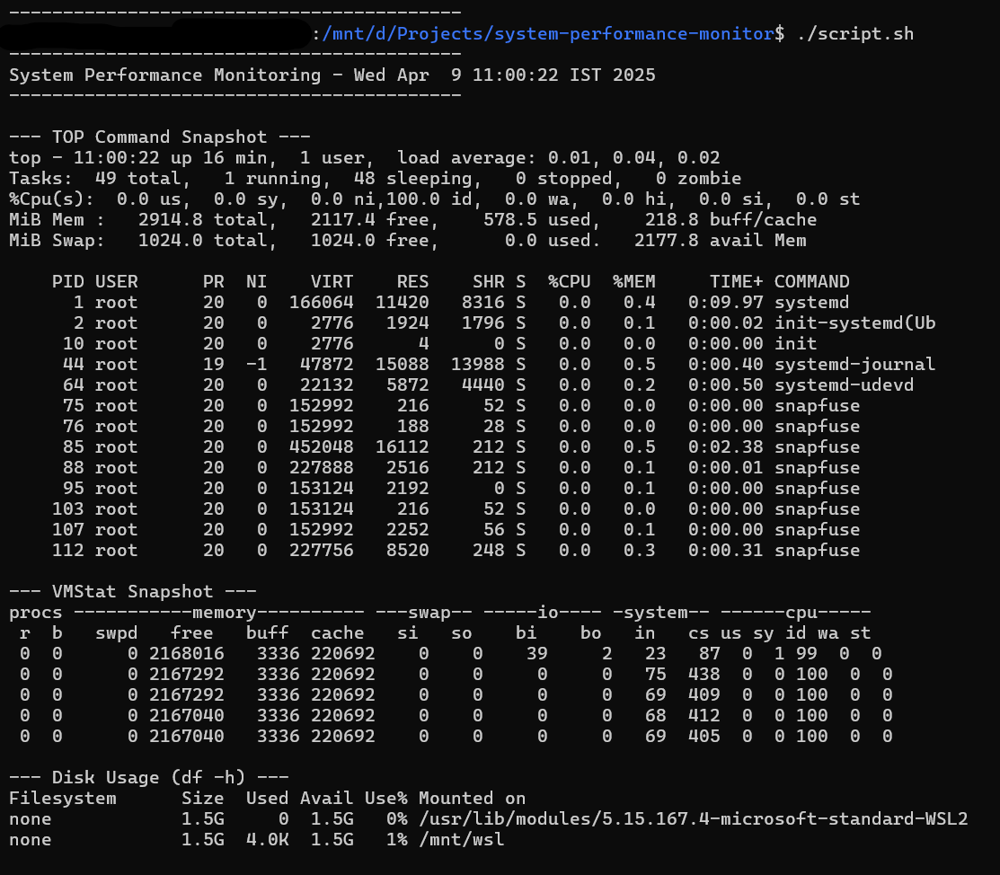

# System Performance Monitoring Script

This script monitors system performance and logs details such as CPU usage, memory usage, disk usage, and running processes. The output is saved in a timestamped log file for easy reference.

## Features
- Captures a snapshot of system performance using commands like `top`, `vmstat`, `df`, and `ps`.
- Generates logs with date and time in the filename.
- Automatically organizes logs in a designated directory.

## Requirements
- A Linux or Unix-like system.
- Basic shell scripting support (`bash`).

## Usage
1. Clone this repository or download the script.
2. Make the script executable:
    ```bash
    chmod +x script.sh
    ```
3. Run the script:
    ```bash
    ./script.sh
    ```   
4. The logs will be saved in the logs directory with a filename format:
    ```bash
    performance_YYYY-MM-DD_HH-MM-SS.log
    ```

## Automating the Task with Crontab
To automate the system performance monitoring script, you can use crontab to run the script at regular intervals. This ensures that the script runs automatically without manual intervention.

### Steps to Automate with Crontab:
1. Open the crontab editor by running the following command:
    ```bash
    crontab -e
    ```

2. Add a new cron job to schedule the script. For example, to run the script every hour, add the following line:
    ```bash
    0 * * * * /path/script.sh
    ```

- This will run the script at the start of every hour. Replace /path/to/your/script.sh with the full path to your script.
- If you want to run the script at a different interval, you can adjust the cron timing pattern. Here are some examples:
    - Every day at midnight: 0 0 * * * /path/script.sh
    - Every Monday at 9 AM: 0 9 * * 1 /path/script.sh
    - Every 15 minutes: */15 * * * * /path/script.sh

3. Save and exit the crontab editor. The script will now run automatically based on the schedule you set.

### Checking Cron Jobs
To view the list of active cron jobs, use the command:
    ```bash
    crontab -l
    ```

## Log File Structure
A sample log file includes:
- System snapshot using the top command.
- Memory usage details from free.
- Disk usage statistics from df.
- Process summary from ps aux.

## Example Output
Sample log filename:
```
performance_YYYY-MM-DD_HH-MM-SS.log
```

Sample log contents:


## Customization
You can modify the script to:
- Change the log directory.
- Add or remove commands based on your monitoring needs.

## Notes
- Ensure the script has write permissions in the logs directory.

## License
This project is licensed under the MIT License.